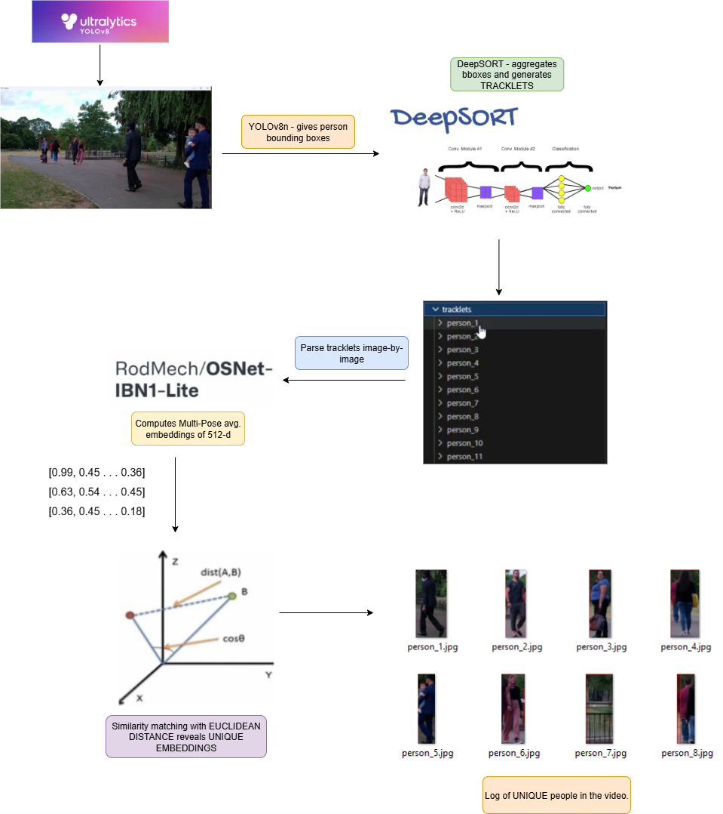

# 📹🤖 SmartLogger-YOLOv8n-DeepSORT-OSNet1.0x-Based-Unique-Visitor-Logging-System
This repo implements a 3-stage unique visitor log generation pipeline that takes CCTV footage over a timeline and generates a list of all unique persons who have appeared in the video. YOLOv8n and DeepSORT are used to generate tracklets &amp; OSNet-1.0x is used to compute multipose avg. embeddings which are matched to obtain unique individuals.

# Demo 👇
<video src="demo.mp4" controls width="640"></video>
[[Link to Demo]](https://youtu.be/jeZw4MNxz0s "Click to watch")

# Overview of the pipeline


## 🚀 Features

* **YOLOv8n**: Accurate **frame-by-frame** person detection.
* **DeepSORT**: Tracks persons frame-by-frame and extracts stable **tracklets** containing person appearences in **multiple poses**.
* **OSNet-1.0x**: Considers **each image** in the tracklets folder per person and computes a **512-d multi-pose avg. embedding**.
---

## 📂 Project Structure

```bash
.
├── yolov8n.pt              # YOLOv8n with COCO weights downloaded from Ultralytics.
├── utils.py                # Utility functions for aggregating detections & generating tracklets
├── yolov8n_inference.ipynb          # Runs the entire log generation pipeline: Detection+Tracking --> Tracklets generation --> Embedding & Similarity matching --> Log generation.
├── tracklets/           # Stores tracklets upon running the pipeline.
├── videos/              # [To be downloaded] A sample video for inference.
├── torchreid/           # [To be downloaded] package holding the dependencies of OSNet embedding generation.
├── unique_people/       # Stores a log of unique people which can be viewed after video inference ends.
├── reid_model/                   # [To be downloaded] Stores the OSNet_1.0x MSMT17 checkpoint used for embedding generation.
       ├── osnet_x1_0_msmt17.pth
├── requirements.txt      # Python dependencies.
├── config.yaml         # parameters concerning video display.
├── osnet_log_generator.py  # Utility functions for generating the unique log via. similarity matching.
├── tracker.py            # The class definition of the DeepSORT tracker injected with optimal parameters for seamless frame-by-frame tracking.

```
## 🔧 Running Dependency

Download **osnet_x1_0_msmt17.pth** from the link [[Link to download]](https://drive.google.com/file/d/15HxslNJuw1VWcOQbwQu1R-LmczI4TPtD/view?usp=drive_link). Place this file inside ```reid_model ```

Download **sidewalk_walking_1920x1080.mp4** from the link [[Link to download]](https://drive.google.com/file/d/1CIzZdJqvJ2vpkk9yGtq9cr0SLmW-Hqbz/view?usp=drive_link). Place this file inside ```videos ```

Download the package **torchreid** from the link [[Link to download]](https://github.com/kaiyangzhou/deep-person-reid). Place this file inside the project directory

   ```bash
   ├── reid_model/
       ├──  osnet_x1_0_msmt17.pth
   ├── videos/
       ├──  sidewalk_walking_1920x1080.mp4
  ├── torchreid/

   ```

## 📜 License

This project is licensed under the [MIT License](LICENSE).

---

## 🙌 Acknowledgements

* [Special Thanks](https://github.com/Ayushman-Choudhuri/yolov5-deepsort) - Another repo that contains a clean implementation of **YOLOv5+DeepSORT** for multi-object tracking.
* [Special Thanks](https://github.com/RodMech/OSNet-IBN1-Lite) - Another repo that unambiguously shows reid embeddings can be extracted, cached & matched using **OSNetx1.0**.
---

### ⭐ If you find this project helpful, don’t forget to star the repo!
